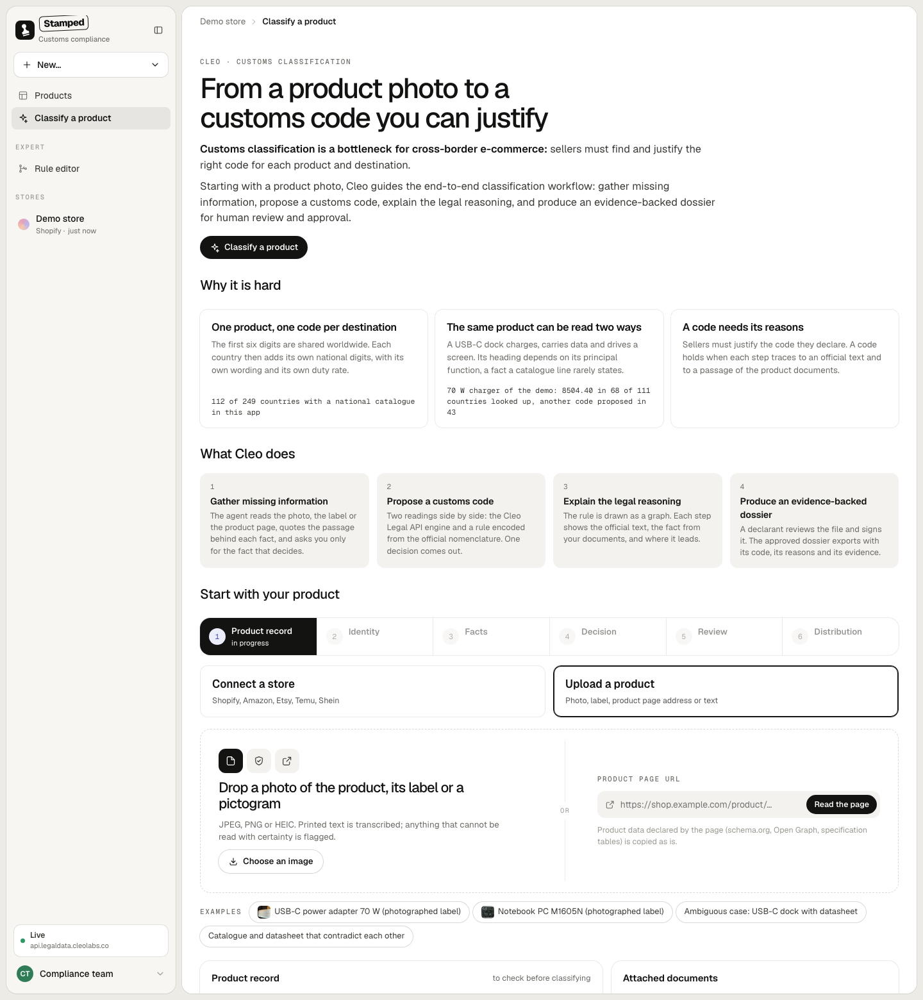

# Cleo Customs Classification

**Customs classification is a bottleneck for cross-border e-commerce: sellers must find and justify the right code for each product and destination.**

Starting with a product photo, Cleo guides the end-to-end classification workflow: gather missing information, propose a customs code, explain the legal reasoning, and produce an evidence-backed dossier for human review and approval.

Live app: https://cleo-customs-classifier.vercel.app/#/dossier (the interface carries the working name *Stamped*).

## Why classification is hard

**One product, one code per destination.** The first six digits of a customs code are shared worldwide (the Harmonized System). Each country then adds its own national digits, with its own wording and its own duty rate. The app holds a national catalogue for 112 of 249 countries and stops at six digits for the 137 others (`public/data/monde-produits.json`, field `couverture`).

**The same product can be read two ways.** A USB-C dock charges, carries data and drives a screen. Its heading depends on its principal function, a fact a catalogue line rarely states. Measured on the two demo products, with one lookup per country on the Cleo Legal API (111 countries answered, 1 failed):

| Product | Code from the encoded rule | Countries where the engine agrees | Countries where the engine proposes another code |
| --- | --- | --- | --- |
| Notebook PC M1605N | 8471.30 | 111 of 111 | 0 |
| USB-C power adapter 70 W | 8504.40 | 68 of 111 | 43 |

**The facts are scattered, and sometimes they conflict.** The decisive fact sits on a label, in a datasheet or on a product page, and the catalogue description can say the opposite. The app reads each document, quotes the passage behind each fact, and stops when two documents contradict each other until a person says which one is true.

**A code needs its reasons.** Sellers must justify the code they declare. A code holds when each step traces to an official text and to a passage of the product documents, and when a person with authority has signed it.

## What the app does

The workflow has six steps, one on screen at a time (`public/app/vues/dossier.js`).

| Step | What happens | Part of the promise |
| --- | --- | --- |
| 1. Product record | You drop a photo of the product, its label or a pictogram, paste a product page address, or write a few lines. | Start from a photo |
| 2. Identity | You confirm which physical product the file is about: manufacturer, model, configuration. | Gather missing information |
| 3. Facts | The agent reads the documents. Each fact cites its passage. You settle contradictions and answer the one question that decides. | Gather missing information |
| 4. Decision | One code, the rule drawn as a graph, and the reason for each choice. | Propose a code, explain the legal reasoning |
| 5. Review | A declarant examines the file and signs. The approval is saved in the Cleo Legal API. | Human review and approval |
| 6. Distribution | Exports of the approved file, what each country requires, and a draft declaration of conformity per market (`public/app/dossier/declaration.js`). Each draft is marked DRAFT and lists what the file has yet to establish. | Evidence-backed dossier |

### Two readings, one decision

Each product is read twice:

- **The engine**: a live call to `POST /v2/customs/classifications` of the Cleo Legal API. It returns candidates, the candidates it set aside and why, questions to the seller, and close official decisions.
- **The encoded rule**: `public/data/arbre.json`, a decision tree written from the Combined Nomenclature 2026 (Implementing Regulation (EU) 2025/1926). 11 criteria, 33 nodes. Scope: notebook computers, chargers and power supplies, power banks, docking stations, hubs, adapters and cables for computers and phones. The pure engine that runs it is `public/arbre-moteur.js`. Each step shows the official rule, the verified fact and the consequence. A missing fact becomes a question that says where each answer leads.

`public/decision.js` reads the two together and gives a single decision. Approval stays closed while a question is open, the two readings disagree, a contradiction is unresolved, or a required national line is missing. A disagreement is settled by a signed arbitration (code retained, reason, elements examined, name), which goes into the dossier.

### Screens

- **Products** (`#/`): one card per product with its photo, its code, its state and where it stands (label read, code found, signed, evidence per market).
- **A product** (`#/produit?sku=…`): overview, *Why this code* (`#/arbre?sku=…`, the rule as a graph), *World* (`#/monde?sku=…`, the tariff line and base duty per country, the requirements per market with the official sentence behind each), and the classification file (`#/dossier?sku=…`).
- **Classify a product** (`#/dossier`): the six-step workflow above, for a new product.
- **Shipments** (`#/envois`): shown when the store has orders. Each order line is checked for its delivery country on the code of the product's single decision.
- **Rule editor** (`#/arbre`): for experts. Editing a branch requires a reading in one sentence and a signature; the result and the replay on official decisions are recomputed. The edited version stays a working version in the browser.

## What is verified

Every figure below is counted from a file of this repository.

| What | Count | Where |
| --- | --- | --- |
| Passages of the Combined Nomenclature 2026 behind the encoded rule, found word for word | 59 | `public/data/textes.json`, `node essais/arbre/verifier-textes.mjs` |
| Official decisions the rule is replayed on | 87 (13 EU classification regulations, 74 US CBP rulings) | `public/data/decisions.json` |
| Replay of the rule on those 87 decisions | 38 reproduced, 1 contradicted, 35 undecided, 13 out of scope | `essais/arbre/bilan.md` |
| Market requirements for the two demo products | 62 in 11 markets (EU, GB, CH, US, CA, MX, JP, KR, AU, NZ, TW), each with a quote from the official text | `public/data/monde-produits.json`, `node essais/monde/verifier.mjs <file>` |
| Market access checklist for France (chargers and external power supplies, code 8504.40) | 20 requirement lines, 76 duties, 3 roles, 18 questions, 171 passages of EU acts | `public/data/exigences.json`, `public/data/textes-conformite.json` |

How to read the replay: of the 38 reproduced decisions, 12 rest on facts the decision states explicitly at every step. The 26 others go through at least one deduced value. `essais/arbre/bilan.md` gives the detail.

## Limits

- The encoded rule, the product records behind the replay and the requirement lists are drafted by AI from the official texts they cite. A customs declarant or a lawyer has not reviewed them.
- The engine answers at six digits. National lines come from a separate lookup (`GET /v2/customs/lookup`) and are proposals.
- The France checklist covers EU acts only: French national rules and standards are absent (`essais/conformite/bilan.md`).
- The requirement lists are partial. The gaps are written in the `.md` file next to each `essais/monde/reglementation-*.json`.
- The app states what a file holds and what is missing. It does not state that a product is compliant.

## Run it

Node 22, no dependency to install.

    node server.mjs                # http://localhost:4318

Settings are read from `.env` (never sent to the browser):

| Variable | Use |
| --- | --- |
| `CLEO_API_KEY` | Key of the Cleo Legal API. Without it, the app runs offline (see below). |
| `CLEO_BASE_URL` | Address of the API, to point at another environment or at a replay server. |
| `BEDROCK_REGION`, `BEDROCK_MODEL` | Claude on Amazon Bedrock, used to read photos and documents. Default model: `global.anthropic.claude-sonnet-5-5`. |
| `APP_CODE` | Optional access code, sent by the browser in the `X-App-Code` header. |
| `PORT` | Local port. |

**Offline** (no `CLEO_API_KEY`): the real responses recorded in `public/data/enregistrees.json` are replayed when the documents sent are exactly the same, and the screen says so. Without Bedrock access, the reading of photos and documents is reported as not done.

**Reading a product page** (`POST /api/url`, `lib/page.mjs`): schema.org data, Open Graph tags and specification tables are copied as they are, with no model. Private hosts are refused, including after a redirect.

### Tests and probes

    node --test tests/*.test.mjs

28 tests of `tests/obligations.test.mjs` read recorded API responses kept outside the repository (`essais/modules/obligations-raw/`) and fail without them.

Browser probes (Playwright), each one plays a full journey on the running app:

    node sonde-parcours.mjs dock               # docking station, engine and rule disagree
    node sonde-parcours.mjs chargeur <photo>   # from a photographed label
    node sonde-epreuves.mjs                    # rephrase, remove a fact, introduce a contradiction
    node sonde-conformite.mjs                  # France checklist
    node sonde-arbre.mjs                       # rule editor
    node sonde-regle.mjs                       # encoded rule in the journey

To test the screens without spending API quota, replay one saved real response:

    node essais/rejouer-api.mjs essais/avec-fait-1.json 4341
    CLEO_BASE_URL=http://localhost:4341 PORT=4340 node server.mjs

This replays a recorded answer. It is not a measurement of the engine.

## Where the data comes from

    node essais/monde/enregistrer.mjs        # real lookups on the Cleo Legal API, countries with a national catalogue
    node essais/monde/verifier.mjs <file>    # downloads each official source again and looks for the quote word for word
    node essais/monde/assembler.mjs          # public/data/monde-produits.json
    node essais/monde/construire-veille.mjs  # public/data/veille.json, from verified entries only
    node essais/arbre/assembler.mjs          # the encoded rule and its replay on the 87 decisions
    node essais/demo/generer.mjs             # default store: the two demo products

## Repository layout

| Path | Content |
| --- | --- |
| `server.mjs`, `app.mjs`, `api/` | Local server and Vercel function. They relay the browser to the Cleo Legal API and to Bedrock; the keys stay on the server. |
| `lib/` | Client of the Cleo Legal API, reading of product pages, applicability of a close decision, obligations and cost. |
| `public/app/` | The interface, plain JavaScript modules without a build step. |
| `public/arbre-moteur.js`, `public/decision.js`, `public/exigences-moteur.js` | Pure engines shared by the browser and the tests: encoded rule, single decision, market requirements. |
| `public/data/` | The encoded rule, the official texts, the decisions, the requirements, the demo store. |
| `essais/` | Scripts that build and verify the data, and the measurement notes. |
| `tests/` | Unit tests of the engines and of the server routes. |
